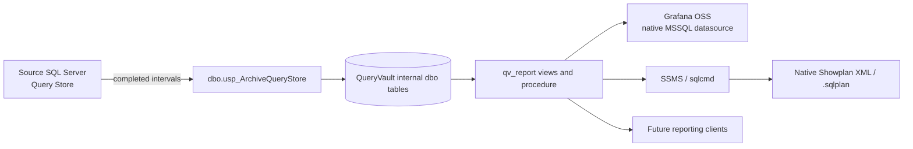
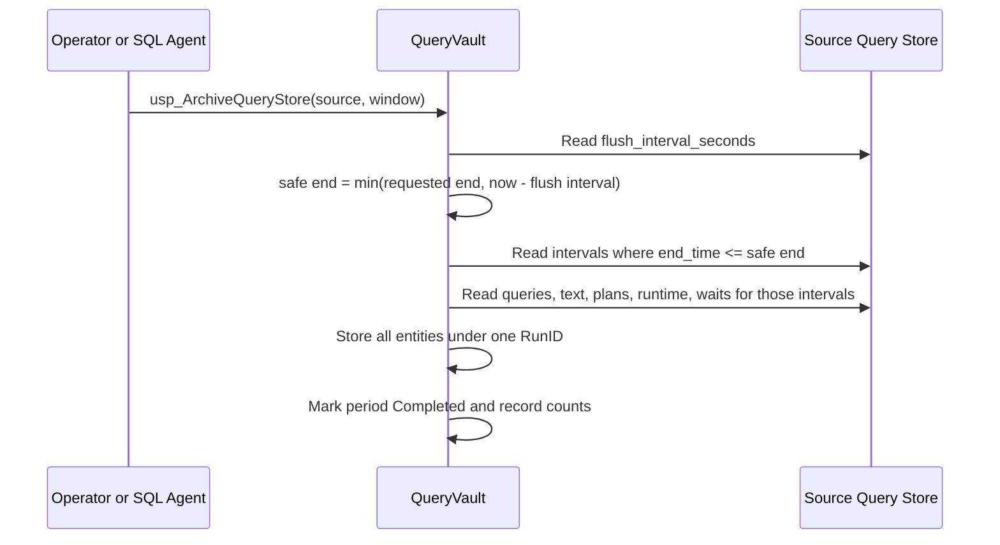
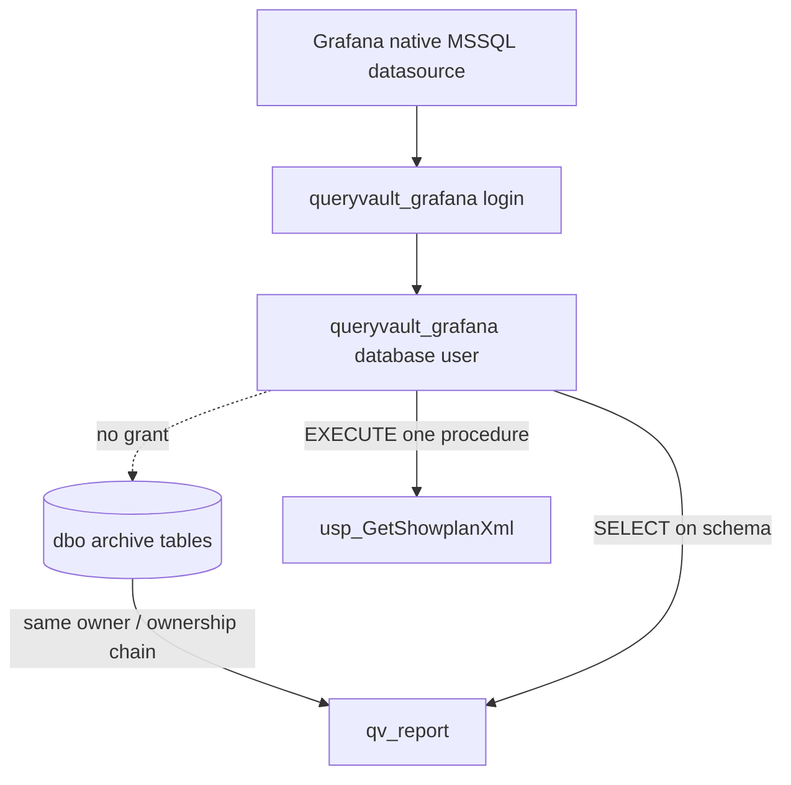

# QueryVault Architecture

## System boundary

Only `qv_report` is a supported visualization/reporting contract. `dbo` tables
and partition-maintenance tables are implementation details and may not be used
by dashboards or future clients as a shortcut.

## Capture flow

The cutoff is essential: an active Query Store interval can contain separate
persisted and in-memory rows at the same documented aggregation grain. Current
capture also fails closed if repeated grains are observed. This prevents a bad
completed run but does not implement canonical source aggregation; reporting is
valid only for archive periods that pass these safeguards or are independently
reconciled.

## Reporting flow and trust

`qv_report` must be owned by `dbo`. The reporting reader receives schema-level
`SELECT` and object-level `EXECUTE`, not internal table permissions. Credentials
come from the Grafana environment or an external secret manager and are never
stored in Git.

## Contract evolution

V1 objects and column semantics are documented in
[the reporting plan](GRAFANA_REPORTING_PLAN.md). Changes should be additive.
When a dashboard needs unavailable data, change and document the contract first;
do not hide a dependency on internal objects inside dashboard JSON.
