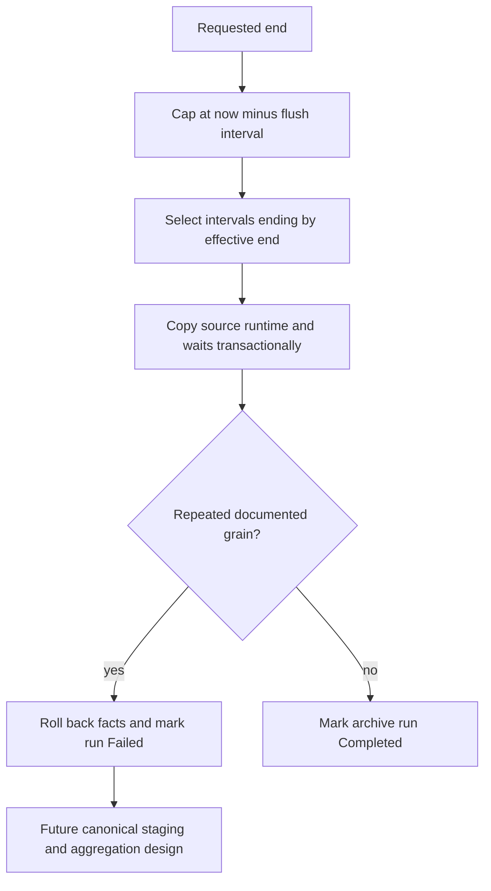

# Query Store Capture Correctness

## Microsoft-documented grains

An active Query Store interval can expose separate persisted and in-memory
runtime rows for the same `(plan_id, execution_type,
runtime_stats_interval_id)`. Consumers must aggregate at that grain;
`runtime_stats_id` alone is not a complete interval observation. Wait data has
the corresponding grain plus `wait_category`.

References:

- [sys.query_store_runtime_stats](https://learn.microsoft.com/en-us/sql/relational-databases/system-catalog-views/sys-query-store-runtime-stats-transact-sql?view=sql-server-ver17)
- [sys.query_store_wait_stats](https://learn.microsoft.com/en-us/sql/relational-databases/system-catalog-views/sys-query-store-wait-stats-transact-sql?view=sql-server-ver17)

## Integrated capture behavior

`dbo.usp_ArchiveQueryStore` applies two layers of protection:

1. it reads `flush_interval_seconds`, caps the requested end at current UTC
   minus one flush interval, and selects only intervals ending by that effective
   end; and
2. after copying runtime or wait rows inside the archive transaction, it rejects
   any repeated documented-grain group and rolls back the archive data before
   the run can be marked complete.

The guard prevents a newly detected duplicate from becoming an apparently valid
completed period. It does not aggregate the observations and therefore does not
satisfy the complete hard requirement.

Status:

- completed-interval preference: **IMPLEMENTED**;
- duplicate-grain rejection: **IMPLEMENTED**;
- canonical runtime aggregation: **PARTIAL / not implemented**;
- canonical wait aggregation: **PARTIAL / not implemented**;
- provisional active-interval reconciliation: **MISSING**.

## Why rejection is not aggregation

Runtime aggregation must sum `count_executions`, compute execution-weighted
means, preserve extrema, select chronological last values, and combine standard
deviation correctly. Wait aggregation must preserve additive wait totals and
define average, extrema, last, and dispersion semantics in relation to the
matching execution population.

Using `DISTINCT`, choosing an arbitrary source ID, or keeping only the newest
row would discard measurements. The existing target rows also expose one native
`runtime_stats_id`/`wait_stats_id` and one `replica_group_id`; relabeling one as
a canonical multi-row aggregate would lose lineage and misstate its meaning.

The smallest correct design is documented in
[Target and Gap Analysis](TARGET_GAP_ANALYSIS.md). It requires consistent source
staging, reviewed combination formulas, contributor lineage, and reconciliation.
It is not implemented here because this integration is not authorized to
redesign internal storage.

## Reporting behavior

`qv_report` aggregates archived measurements for dashboards; it does not repair,
deduplicate, or conceal invalid archive rows. That boundary is intentional:
reporting must not invent data-correction policy. A completed period produced by
the integrated guarded capture cannot contain repeated documented grains, but
legacy data can.

## Validation evidence

Voyager1's SQL Server 2019 audit found 884 archived runtime rows with two
duplicate logical groups from the older deployed capture procedure. It found no
duplicate wait groups among only six wait rows. These results prove the runtime
risk and do not establish wait correctness.

Voyager2's current archive contained 2,366 runtime and 391 wait rows with zero
duplicate documented-grain groups and zero interval orphans. Nine early
Voyager2 periods—RunIDs 1, 2, 5, 6, 7, 8, 9, 14, and 15—contain intervals whose
end exceeds the period's recorded end. They predate the cutoff safeguard and can
be partial even without duplicate rows.

Safe handling:

1. exclude known legacy/partial periods from baseline decisions;
2. re-archive retained source windows with the guarded procedure where possible;
3. preserve originals until replacements reconcile; and
4. purge only through normal reviewed retention handling.

## Regression coverage

- `TestQueryStoreAggregationGrain.sql` checks cutoff/predicate presence,
  duplicate target groups, interval orphans, and reports historical boundary
  violations.
- `TestProcedureCompilation.sql` compiles the hardened core procedures inside a
  rolled-back transaction.
- `TestRepositoryContracts.ps1` verifies that rejection guards and declarative
  model sources remain synchronized.

