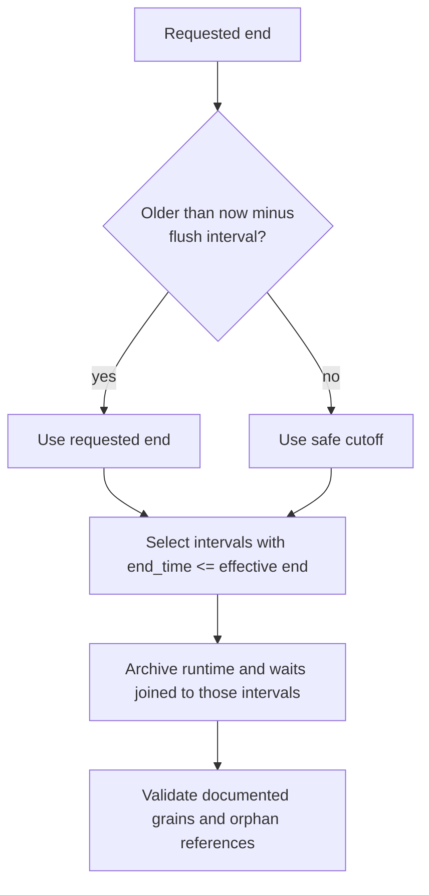

# Query Store Capture Correctness

## Required grain

SQL Server documents that an active Query Store interval can expose multiple
runtime rows for the same `(plan_id, execution_type,
runtime_stats_interval_id)`. Consumers must aggregate at that grain; a
`runtime_stats_id` alone is not a complete active-interval identity. Wait data
has the corresponding grain plus `wait_category`.

References:

- [sys.query_store_runtime_stats](https://learn.microsoft.com/en-us/sql/relational-databases/system-catalog-views/sys-query-store-runtime-stats-transact-sql?view=sql-server-ver17)
- [sys.query_store_wait_stats](https://learn.microsoft.com/en-us/sql/relational-databases/system-catalog-views/sys-query-store-wait-stats-transact-sql?view=sql-server-ver17)

## Current capture: PASS

`dbo.usp_ArchiveQueryStore` reads the source's
`flush_interval_seconds`, computes `now UTC - flush interval`, and caps the
requested end at that safe cutoff. Runtime, wait, and interval reads require
`i.end_time <= @EndDateTime`. QueryVault therefore archives past intervals,
where the documented catalog behavior provides one row at the relevant grain.

Live Voyager2 evidence on 2026-09-03:

- procedure contains both the flush cutoff and completed interval filter;
- zero duplicate runtime groups at `(RunID, plan_id, execution_type,
  runtime_stats_interval_id)`;
- zero duplicate wait groups at `(RunID, plan_id,
  runtime_stats_interval_id, execution_type, wait_category)`;
- zero runtime and wait interval orphans.

The archive does not aggregate by `runtime_stats_id`; it preserves source rows.
That is correct for the deliberately excluded-active-interval capture model.

## Historical corpus: PARTIAL

Nine Voyager2 periods—RunIDs 1, 2, 5, 6, 7, 8, 9, 14, and 15—contain at least
one archived interval whose end is after `RunMetadata.EndDateTime`. These runs
precede the completed-interval safeguard added on 2026-08-28. They contain no
duplicate grain groups, but an active-interval snapshot can still be partial and
must not be assumed final merely because no duplicate is present.

Smallest safe repair:

1. exclude these periods from baseline/regression decisions now;
2. if the source still retains the exact windows, re-archive them as new runs
   using current capture and validate boundaries;
3. preserve the original periods until the replacements are reconciled;
4. purge originals only through normal reviewed retention handling.

No in-place rewrite is implemented because it would manufacture finality from
an incomplete historical snapshot and because source availability has not been
established.

## Regression test

`QueryVault/Tests/TestQueryStoreAggregationGrain.sql` fails when the cutoff or
completed-interval predicate disappears, when documented-grain duplicates
exist, or when runtime/wait rows have orphaned intervals. Historical boundary
violations are emitted as review rows rather than failing every upgraded
installation.

