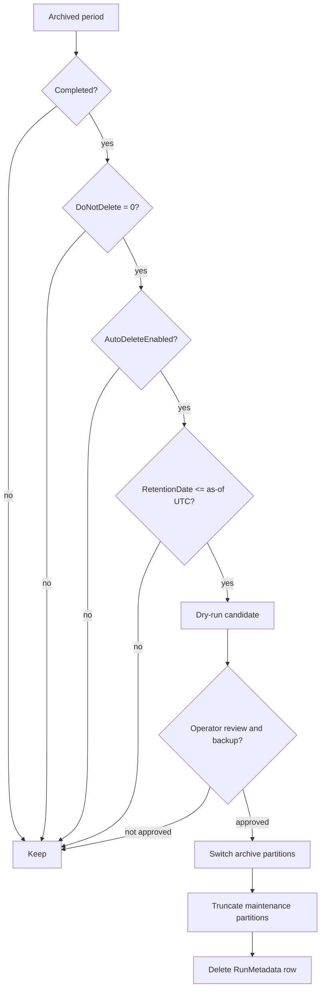

# QueryVault Retention

Each unprotected archive run receives a `RetentionDate` based on the run's
explicit retention value or the source configuration's
`DefaultRetentionDays`. A protected run (`DoNotDelete = 1`) has no automatic
retention date.

`dbo.usp_PurgeExpiredArchives` considers only periods that are:

- `Completed`;
- not protected;
- past a non-null retention date; and
- associated with a source configuration whose `AutoDeleteEnabled = 1`.



## Safe operation

Always begin with:

```sql
EXEC dbo.usp_PurgeExpiredArchives
    @AsOfDateTime = SYSUTCDATETIME(),
    @DryRun = 1;
```

Confirm candidates, protected baselines, backup status, partition alignment,
and retention policy before rerunning with `@DryRun = 0`. The production
deployment script does not execute purge automatically and does not alter SQL
Agent jobs.

Purging is destructive. Partition switch/truncate removes the six archived
Query Store entity sets for the selected RunID, then deletes its metadata. A
verified database backup is the recovery path.

The integrated partition procedure refuses to switch or truncate a physical
partition that contains another `RunID`, and direct operations own a transaction
when the caller does not. A rejection indicates partition-boundary or legacy
constraint work that must be reviewed; do not disable the guard.

## Reporting effect

Purged periods disappear from `qv_report.periods` and Grafana variables. A
dashboard or external report must not assume period IDs are contiguous. Period
classification is currently unimplemented and does not affect retention.
