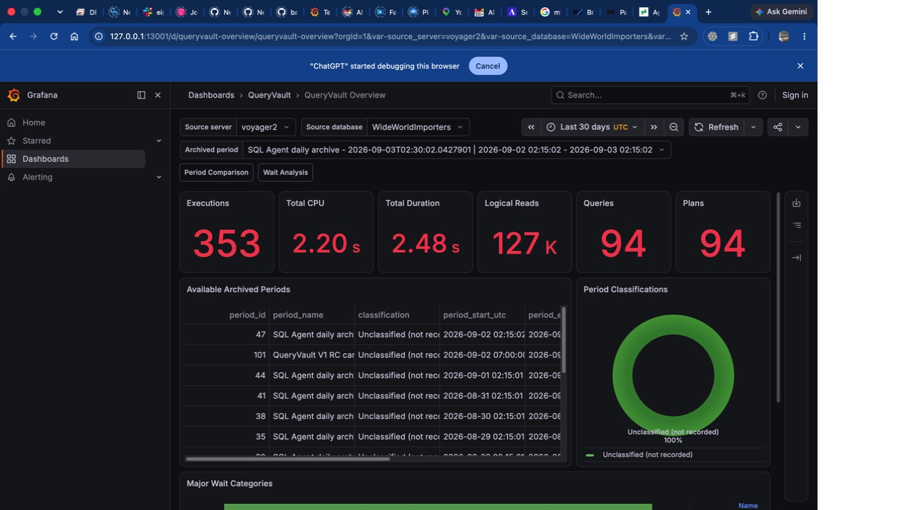
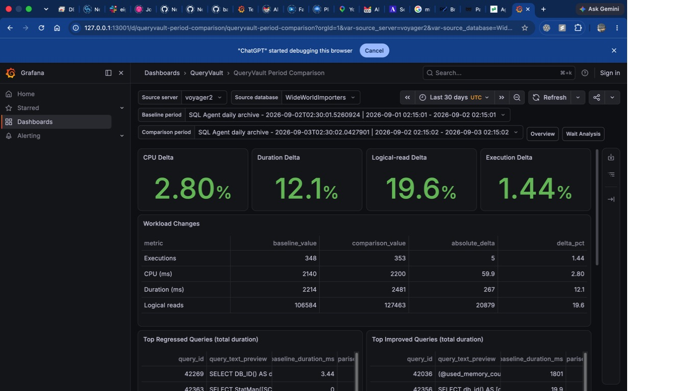
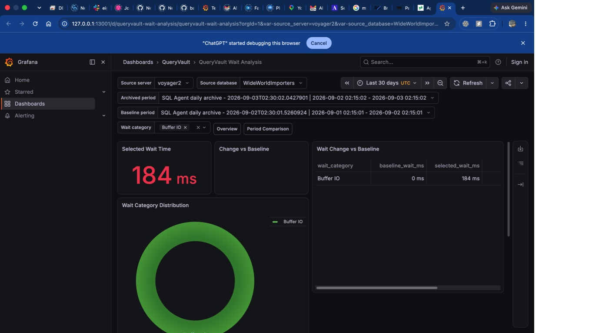
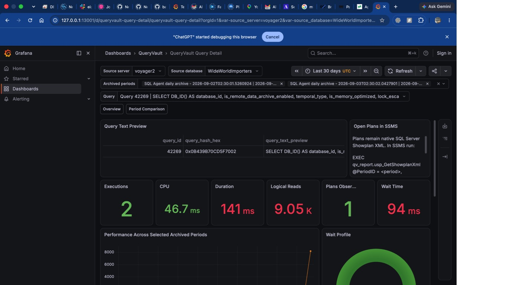

# QueryVault Screenshot Record

Actual captures were taken on 2026-09-03 from the dedicated Voyager2
QueryVault Grafana OSS 13.1.0 instance after datasource, permission, API query,
and real-data validation passed. They are unedited browser captures and expose
no connection password or admin session.

Selected evidence:

- source: `voyager2` / `WideWorldImporters`;
- Overview archived period: RunID 47;
- comparison: baseline RunID 44, comparison RunID 47;
- Wait Analysis category: Buffer IO (category 6);
- Query Detail: query 42269 over RunIDs 44 and 47.

| Status | Filename | UI state and caption |
| --- | --- | --- |
| CAPTURED | `docs/images/grafana-overview-period.jpg` | QueryVault Overview shows 353 executions, CPU/duration/reads, 94 queries/plans, available periods (including live validation RunID 101), explicit unclassified state, and waits through `qv_report`. |
| CAPTURED | `docs/images/grafana-period-comparison.jpg` | Period Comparison shows equal-duration RunIDs 44 and 47, four percentage deltas, workload changes, and populated query regression/improvement tables. |
| CAPTURED | `docs/images/grafana-wait-analysis.jpg` | Wait Analysis shows 184 ms Buffer IO, distribution, and baseline comparison. The live DOM/API check also confirmed eight contributing-query rows and corrected ID/percentage formatting. |
| CAPTURED | `docs/images/grafana-query-detail.jpg` | Query Detail shows a non-sensitive system-catalog query, two archived periods, KPI values, wait profile, performance history, plan metadata, and native Showplan retrieval instructions. |
| NOT TESTED | `docs/images/grafana-datasource.jpg` | Not captured. Datasource health and secret-field presence were verified through the authenticated Grafana API; a credentials/configuration UI screenshot was intentionally avoided. |
| NOT TESTED | `docs/images/ssms-showplan-xml-result.jpg` | SSMS was unavailable. Native XML validity and `.sqlplan` export passed without exposing the XML in Grafana. |
| NOT TESTED | `docs/images/ssms-showplan-opened.jpg` | SSMS graphical rendering was not available and is not inferred. |

## Captures

### QueryVault Overview

### Period Comparison

### Wait Analysis

### Query Detail

The selected periods are outside the nine known pre-safeguard period IDs. The
query text is SQL Server system-catalog inspection rather than business data.
No screenshot was manufactured or edited to simulate results.
